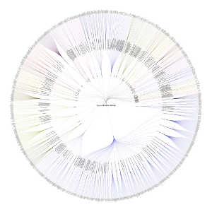
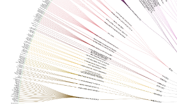

Provider Specialty Radial Reingold-Tilford Tree Diagram
=====================

A beautiful but somewhat pointless visualizaiton of the Meditech Provider Dictionary, using the Meditech Data Repository and the [D3.js visualization library](http://d3js.org). 

This simple TSQL Query will return a flat (tabular) dataset.

    SELECT DISTINCT
    	 REPLACE([DBLevelBName], ',',' ') AS [Location]
    	,[SpecialtyID] AS [Specialty]
    	,REPLACE([StmtName], ',',' ') AS [Provider]
    FROM livedb.dbo.DPbrProvider 
    Where [SpecialtyID] IS NOT NULL 
    	AND [DBLevelBID] != 'ZZZ.MISC'
    	AND [StmtName] NOT IN ('UNKNOWN', ' DIAGNOSTIC')
    Group By [DBLevelBName], [SpecialtyID], [StmtName]

Export the results of this query to a CSV and include the column headers on row 1. If you want to connect directly to the SQL Server to retreive the data you may want to review some of this post- 

    http://nyquist212.wordpress.com/2014/03/04/getting-json-from-ms-sql-server-2012-with-php/

Tree and Cluster diagrams require heirarchial data (nested data with parent and child elements). This example generates the heirarchial JSON on the fly from the flat tabular data in the CSV file. All this processing is performed by Javascript in your web browser.

The JSON generation alogrythm comes from this post -

    http://www.delimited.io/blog/2013/11/2/creating-nested-json-for-d3
 

